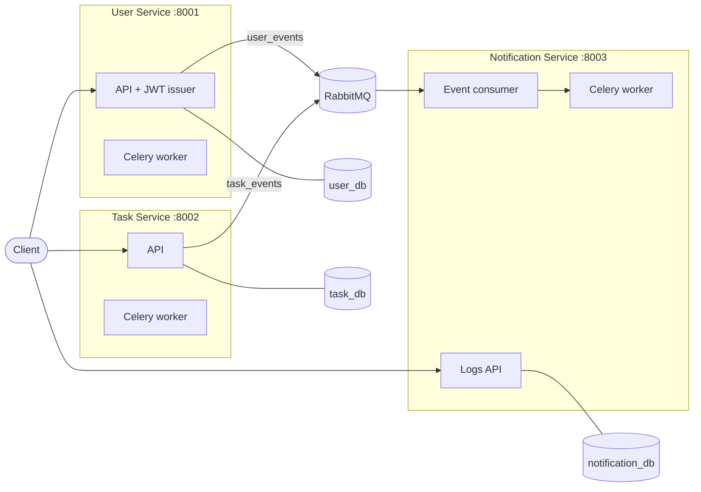

# TaskFlow

TaskFlow is a task management application built as three Django REST
Framework microservices that communicate over RabbitMQ, each with its own
PostgreSQL database, orchestrated with Docker Compose.

1. **User Service** (`:8001`) — registration, email OTP verification, JWT
   issuance (RS256), profile and password management.
2. **Task Service** (`:8002`) — task CRUD and assignment, secured with JWTs
   verified against the user service's public key.
3. **Notification Service** (`:8003`) — consumes events from RabbitMQ,
   records notification logs, and sends emails via Celery.

## Architecture



- JWTs are signed **RS256** by the user service (private key); the task and
  notification services verify with the **public key only** — no service
  except the issuer can mint tokens.
- Events are published to durable topic exchanges via Celery (retries with
  backoff; API requests never fail because the broker is down). The consumer
  uses a durable queue with manual acks and a dead-letter queue for poison
  messages.

## Prerequisites

- [Docker](https://www.docker.com/get-started) with Compose
- OpenSSL (for JWT key generation)

## Setup

```bash
git clone https://github.com/amanuelmr/taskflow.git
cd taskflow

# 1. Environment: copy the example and fill in real values
cp .env.example .env

# 2. Generate the RS256 keypair (gitignored)
openssl genrsa -out secrets/jwt_private.pem 2048
openssl rsa -in secrets/jwt_private.pem -pubout -out secrets/jwt_public.pem

# 3. Build and start everything
docker compose up --build
```

`docker compose up` uses `docker-compose.override.yml` automatically: the
Django dev server with live source reload. For a production-shaped run
(gunicorn, no source mounts): `docker compose -f docker-compose.yml up`.

By default emails are printed to the worker logs (console backend). To send
real email, set `EMAIL_BACKEND=django.core.mail.backends.smtp.EmailBackend`
and the `EMAIL_*` credentials in `.env`.

## API

Swagger UI is available on each service at `/swagger/` (ReDoc at `/redoc/`).

### User Service — `http://localhost:8001`

| Method | Endpoint | Description |
|---|---|---|
| POST | `/api/register/` | Register; emails a 6-digit OTP |
| POST | `/api/verify-email/` | Verify email with OTP |
| POST | `/api/login/` | Obtain JWT pair (requires verified email) |
| POST | `/api/token/refresh/` | Refresh an access token |
| GET | `/api/me/` | Current user profile |
| PUT/PATCH | `/api/me/update/` | Update profile |
| PUT | `/api/me/change-password/` | Change password |
| POST | `/api/forgot-password/` | Request password-reset OTP |
| POST | `/api/reset-password/` | Reset password with OTP |

### Task Service — `http://localhost:8002`

| Method | Endpoint | Description |
|---|---|---|
| GET/POST | `/api/tasks/` | List own/assigned tasks; create a task |
| GET/PUT/PATCH/DELETE | `/api/tasks/{id}/` | Retrieve/modify/delete (owner only; assignee may read) |
| POST | `/api/tasks/{id}/assign/` | Assign to a user (owner only) |

### Notification Service — `http://localhost:8003`

| Method | Endpoint | Description |
|---|---|---|
| GET | `/api/logs/` | Notification event logs (authenticated) |

All task/notification endpoints require `Authorization: Bearer <access token>`.

## Example flow

```bash
# Register (OTP is printed in the user-celery-worker logs with the console backend)
curl -X POST http://localhost:8001/api/register/ \
  -H "Content-Type: application/json" \
  -d '{"username":"alice","email":"alice@example.com","password":"Str0ng-Passw0rd!"}'

# Verify
curl -X POST http://localhost:8001/api/verify-email/ \
  -H "Content-Type: application/json" \
  -d '{"email":"alice@example.com","otp":"123456"}'

# Login
curl -X POST http://localhost:8001/api/login/ \
  -H "Content-Type: application/json" \
  -d '{"username":"alice","password":"Str0ng-Passw0rd!"}'

# Create a task
curl -X POST http://localhost:8002/api/tasks/ \
  -H "Content-Type: application/json" \
  -H "Authorization: Bearer <access>" \
  -d '{"title":"Write report"}'

# Assign it
curl -X POST http://localhost:8002/api/tasks/1/assign/ \
  -H "Content-Type: application/json" \
  -H "Authorization: Bearer <access>" \
  -d '{"user_id":2}'
```

## Development

Each service has its own test suite (sqlite, no broker needed):

```bash
cd user_service          # or task_service / notification_service
pip install -r requirements-dev.txt
pytest
ruff check .
```

CI (GitHub Actions) lints and tests all three services and builds the
Docker images on every push/PR.

### Notes & future work

- `rabbitmq_utils.py` is intentionally duplicated between user and task
  services (no shared runtime); keep the copies in sync.
- A transactional outbox could replace Celery-based publishing if
  exactly-once event delivery becomes a requirement.
- The notification service only has user ids for task events; a user cache
  (fed from user_events) would let it email assignees.

## Security

- Secrets live in `.env` / mounted key files — never commit them.
- If a credential does get committed, rotate it immediately; git history
  keeps it forever.
